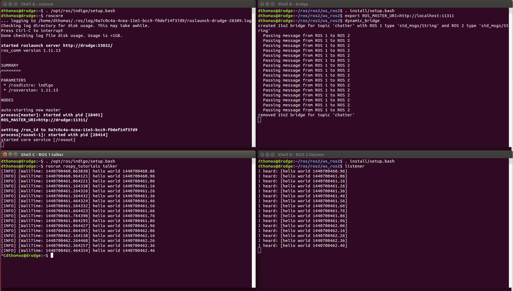
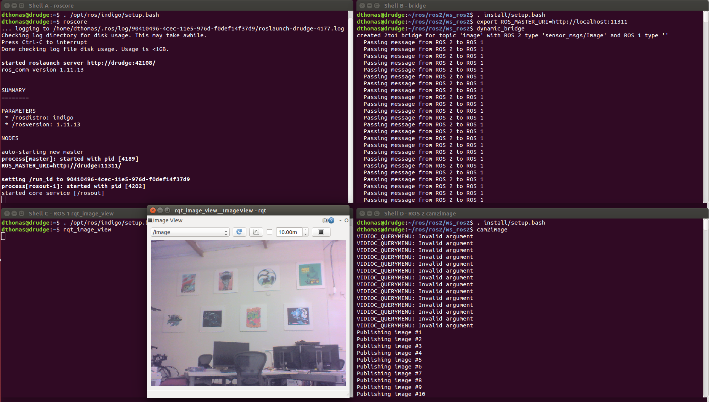

# Bridge communication between ROS 1 and ROS 2

This package provides a network bridge which enables to exchange messages between ROS 1 and ROS 2.

The bridge has currently only been implemented in C++ as at the time the Python API for ROS 2 had not been developed.
Because of this its support is limited to only the message/service types available at compile time of the bridge.
The bridge included with the prebuilt ROS 2 binaries supports the interface packages listed in the [ros2/common_interfaces repository.](https://github.com/ros2/common_interfaces)
*Note:* For binary releases up to and including `release-alpha8`, some of the aforemention interfaces are skipped - check the git tag of the release in question to know which packages were built.


## Prerequisites

In order to run the bridge you need to either:

* get [prebuilt binaries](https://github.com/ros2/ros2/releases) or
* build the bridge as well as the other ROS 2 packages from source.

After that you can run both examples described below.

For all examples you need to source the environment of the ament install space where the bridge was built or unpacked to.
Additionally you will need to either source the ROS 1 environment or at least set the `ROS_MASTER_URI` and run a `roscore`.

The following ROS 1 packages are required to build and use the bridge:
* `catkin`
* `roscpp`
* `rosmsg`
* `std_msgs`
* as well as the Python package `rospkg`


### Building the bridge from source

Before continuing you should have ROS 2 built from source following [these](https://github.com/ros2/ros2/wiki/Installation) instructions.

In the past, building this package required patches to ROS 1, but in the latest releases that is no longer the case.
If you run into trouble first make sure you have at least version `1.11.16` of `ros_comm` and `rosbag`.

Also, building the ROS 1 bridge can consume a tremendous amount of memory (almost 4 GB of free RAM per thread while compiling) to the point that it can easily overwhelm a computer if done with parallel compilation enabled.
As such, we recommend first building everything else as usual, then coming back to build the ROS 1 bridge without parallel compilation.

The bridge uses `pkg-config` to find ROS 1 packages.
ROS 2 packages are found through CMake using `find_package()`.
Therefore the `CMAKE_PREFIX_PATH` must not contain paths from ROS 1 which would overlay ROS 2 packages.

Here are the steps (for Linux and OSX; you probably don't have ROS 1 installed on Windows).

You should first build everything but the ROS 1 bridge with normal make arguments.
We don't recommend having your ROS 1 environment sourced during this step as it can add OpenCV 3 to your path.
The ROS 2 image demos you build in this step would then use OpenCV 3 and require it to be on your path when you run them, while the standard installation on Ubuntu Xenial is OpenCV 2.

```
src/ament/ament_tools/scripts/ament.py build --build-tests --symlink-install --skip-packages ros1_bridge
```

Next you need to source the ROS 1 environment, for Linux and ROS Kinetic that would be:

```
source /opt/ros/kinetic/setup.bash
# Or, on OSX, something like:
# . ~/ros_catkin_ws/install_isolated/setup.bash
```

Then build just the ROS 1 bridge with `-j1`:

```
src/ament/ament_tools/scripts/ament.py build --build-tests --symlink-install -j1 --only ros1_bridge
```

*Note:* If you have built your ROS 2 workspace using `--isolated`, you will need to add the message/service packages you want to bridge to your path before building the bridge, e.g. by sourcing `local_setup.*`.

## Example 1: run the bridge and the example talker and listener

The talker and listener can be either a ROS 1 or a ROS 2 node.
The bridge will pass the message along transparently.

*Note:* When you are running these demos make sure to only source the indicated workspaces.
You will get errors from most tools if they have both workspaces in their environment.


### Example 1a: ROS 1 talker and ROS 2 listener

First we start a ROS 1 `roscore`:

```
# Shell A:
. /opt/ros/kinetic/setup.bash
# Or, on OSX, something like:
# . ~/ros_catkin_ws/install_isolated/setup.bash
roscore
```

---

Then we start the dynamic bridge which will watch the available ROS 1 and ROS 2 topics.
Once a *matching* topic has been detected it starts to bridge the messages on this topic.

```
# Shell B:
. /opt/ros/kinetic/setup.bash
# Or, on OSX, something like:
# . ~/ros_catkin_ws/install_isolated/setup.bash
. <install-space-with-bridge>/setup.bash
export ROS_MASTER_URI=http://localhost:11311
dynamic_bridge
```

The program will start outputting the currently available topics in ROS 1 and ROS 2 in a regular interval.

---

Now we start the ROS 1 talker.

```
# Shell C:
. /opt/ros/kinetic/setup.bash
# Or, on OSX, something like:
# . ~/ros_catkin_ws/install_isolated/setup.bash
rosrun rospy_tutorials talker
```

The ROS 1 node will start printing the published messages to the console.

---

Now we start the ROS 2 listener.
It is important to use the listener from the `ros1_bridge` package since it uses different QoS parameters than the "normal" `listener`.

```
# Shell D:
. <install-space-with-ros2>/setup.bash
ros1_bridge_listener
```

The ROS 2 node will start printing the received messages to the console.

When looking at the output in *shell B* there will be a line stating that the bridge for this topic has been created:

```
created 1to2 bridge for topic 'chatter' with ROS 1 type 'std_msgs/String' and ROS 2 type 'std_msgs/String'
```

At the end stop all programs with `Ctrl-C`.
Once you stop either the talker or the listener in *shell B* a line will be stating that the bridge has been torn down:

```
removed 1to2 bridge for topic 'chatter'
```

*Note:* When the bridge is run using the default ROS 2 middleware implementation, which uses Fast RTPS, it does not always remove bridges instantly.
See [https://github.com/ros2/ros1_bridge/issues/38](https://github.com/ros2/ros1_bridge/issues/38).

The screenshot shows all the shell windows and their expected content:




### Example 1b: ROS 2 talker and ROS 1 listener

The steps are very similar to the previous example and therefore only the commands are described.

```
# Shell A:
. /opt/ros/kinetic/setup.bash
# Or, on OSX, something like:
# . ~/ros_catkin_ws/install_isolated/setup.bash
roscore
```

---

```
# Shell B:
. /opt/ros/kinetic/setup.bash
# Or, on OSX, something like:
# . ~/ros_catkin_ws/install_isolated/setup.bash
. <install-space-with-bridge>/setup.bash
export ROS_MASTER_URI=http://localhost:11311
dynamic_bridge
```

---

Now we start the ROS 2 talker.

```
# Shell C:
. <install-space-with-ros2>/setup.bash
talker
```

---

Now we start the ROS 1 listener.

```
# Shell D:
. /opt/ros/kinetic/setup.bash
# Or, on OSX, something like:
# . ~/ros_catkin_ws/install_isolated/setup.bash
rosrun roscpp_tutorials listener
```


## Example 2: run the bridge and exchange images

The second example will demonstrate the bridge passing along bigger and more complicated messages.
A ROS 2 node is publishing images retrieved from a camera and on the ROS 1 side we use `rqt_image_view` to render the images in a GUI.
And a ROS 1 publisher can send a message to toggle an option in the ROS 2 node.

First we start a ROS 1 `roscore` and the bridge:

```
# Shell A:
. /opt/ros/kinetic/setup.bash
# Or, on OSX, something like:
# . ~/ros_catkin_ws/install_isolated/setup.bash
roscore
```

```
# Shell B:
. /opt/ros/kinetic/setup.bash
# Or, on OSX, something like:
# . ~/ros_catkin_ws/install_isolated/setup.bash
. <workspace-with-bridge>/install/setup.bash
export ROS_MASTER_URI=http://localhost:11311
dynamic_bridge
```

---

Now we start the ROS 1 GUI:

```
# Shell C:
. /opt/ros/kinetic/setup.bash
# Or, on OSX, something like:
# . ~/ros_catkin_ws/install_isolated/setup.bash
rqt_image_view /image
```

--

Now we start the ROS 2 image publisher:
```
# Shell E:
. <workspace-with-ros2>/install/setup.bash
cam2image
```

You should see the current images in `rqt_image_view` which are coming from the ROS 2 node `cam2image` and are being passed along by the bridge.

--

To exercise the bridge in the opposite direction at the same time you can publish a message to the ROS 2 node from ROS 1.
By publishing either `true` or `false` to the `flip_image` topic, the camera node will conditionally flip the image before sending it.
You can either use the `Message Publisher` plugin in `rqt` to publish a `std_msgs/Bool` message on the topic `flip_image`, or run one of the two following `rostopic` commands:

```
# Shell F:
. /opt/ros/kinetic/setup.bash
# Or, on OSX, something like:
# . ~/ros_catkin_ws/install_isolated/setup.bash
rostopic pub -r 1 /flip_image std_msgs/Bool "{data: true}"
rostopic pub -r 1 /flip_image std_msgs/Bool "{data: false}"
```

The screenshot shows all the shell windows and their expected content:


